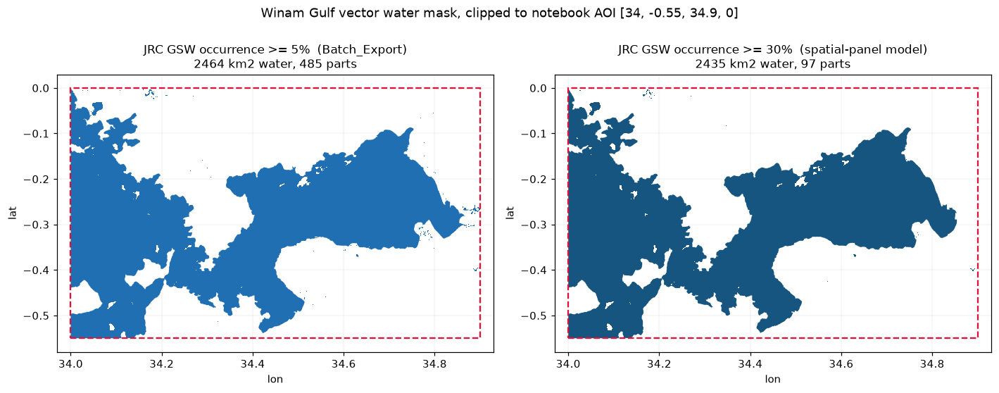

# Winam Gulf AOI & vector water mask

Vector (GeoJSON) mask of the **Winam Gulf** (a.k.a. Kavirondo Gulf, north-east
arm of Lake Victoria), clipped to the area of interest used throughout the
project notebooks. All geometries are **EPSG:4326 (WGS84 lon/lat)**.



## Files

| File | What it is |
|------|------------|
| `winam_gulf_water_mask_occ05.geojson` | **Primary mask** — water where JRC GSW `occurrence ≥ 5 %`, clipped to the AOI. This is the exact "Winam water mask" applied in `Batch_Export.ipynb`. |
| `winam_gulf_water_mask_occ30.geojson` | Stricter variant — `occurrence ≥ 30 %` (permanent water), matching `EE_WATER_OCCURRENCE_THRESHOLD` in `winam_wh_spatial_panel_test_model.ipynb`. |
| `winam_aoi_bbox.geojson` | The AOI rectangle itself, `[34.0, -0.55, 34.9, 0.0]`. |
| `make_winam_mask.py` | Self-contained generator (downloads the source tile and rebuilds all three files). |
| `winam_gulf_mask_preview.png` | Side-by-side preview of the two thresholds. |

Each mask is a single dissolved `(Multi)Polygon` feature; lake islands are
encoded as polygon holes.

## How it was derived (provenance)

The notebooks define the AOI and water mask in Earth Engine as:

```python
# Batch_Export.ipynb / Classifier_Full_Stack_PostExport_TimeSeries_v4.ipynb
winam = ee.Geometry.Rectangle([34, -0.55, 34.9, 0], geodesic=False)
JRC_OCCURRENCE_THRESHOLD = 5
get_jrc_water_mask = ee.Image('JRC/GSW1_4/GlobalSurfaceWater') \
                       .select('occurrence').gte(JRC_OCCURRENCE_THRESHOLD)

# winam_wh_spatial_panel_test_model.ipynb
AOI_BBOX_WGS84 = (34.0, -0.55, 34.9, 0.0)
EE_WATER_OCCURRENCE_THRESHOLD = 30
```

These vectors reproduce that mask **outside** Earth Engine (no EE credentials
needed) from the published source raster:

- **Dataset:** JRC Global Surface Water v1.4 (Pekel et al., 2016), `occurrence`
  band, 1984–2021 — the same product the `JRC/GSW1_4` EE asset is built from.
- **Tile:** `occurrence_30E_0N` (30–40°E, 0 to −10°N), 0.00025° (~28 m) pixels.
- **Steps:** read the AOI window → `occurrence ≥ threshold` (0–100 %, no-data
  excluded) → polygonise → clip to the AOI rectangle → dissolve.

## Summary stats

| Threshold | Water area in AOI | Parts | Largest part (the gulf body) |
|-----------|------------------:|------:|-----------------------------:|
| `≥ 5 %`   | 2464.2 km²        | 485   | 2451.9 km² (99.5 %) |
| `≥ 30 %`  | 2435.2 km²        | 97    | 2428.1 km² (99.7 %) |

The two thresholds trace essentially the same gulf; the higher threshold just
drops scattered ephemeral specks and thin river channels. The "water area in
AOI" exceeds the gulf alone (~1400 km²) because the AOI's south-west corner
opens onto the main body of Lake Victoria.

## Reproduce

```bash
pip install rasterio shapely numpy pyproj
python make_winam_mask.py    # auto-downloads the ~52 MB source tile
```

> Note: the source GeoTIFF (`occurrence_30E_0N_v1_4_2021.tif`) is not committed;
> it is fetched on demand and is git-ignored.
