# Transparent, unfilled dissertation methodology flowcharts

These diagrams mirror the subsection structure of the current methods chapter and follow the order in which the analytical workflow is executed. They reflect the methodology implemented across:

- [`Batch_Export.ipynb`](https://github.com/Qalani/Dissertation/blob/main/Batch_Export.ipynb)
- [`Classifier_Full_Stack_PostExport_TimeSeries_v4.ipynb`](https://github.com/Qalani/Dissertation/blob/main/Classifier_Full_Stack_PostExport_TimeSeries_v4.ipynb)
- [`winam_wh_spatial_panel_predictive_ml.ipynb`](https://github.com/Qalani/Dissertation/blob/main/winam_wh_spatial_panel_predictive_ml.ipynb)
- [`winam_wh_spatial_panel_driver_gam.ipynb`](https://github.com/Qalani/Dissertation/blob/main/winam_wh_spatial_panel_driver_gam.ipynb)

The charts show the analytical design rather than temporary notebook run-control or recovery steps. The final choice between an S2-only response and calibrated S1 gap-filling remains conditional on the sensor-comparison results.

All node and subgraph fills are explicitly transparent. The diagrams retain dark outlines, connectors and text so that they remain legible when placed on a white dissertation page.

## 1. Research design and analytical workflow

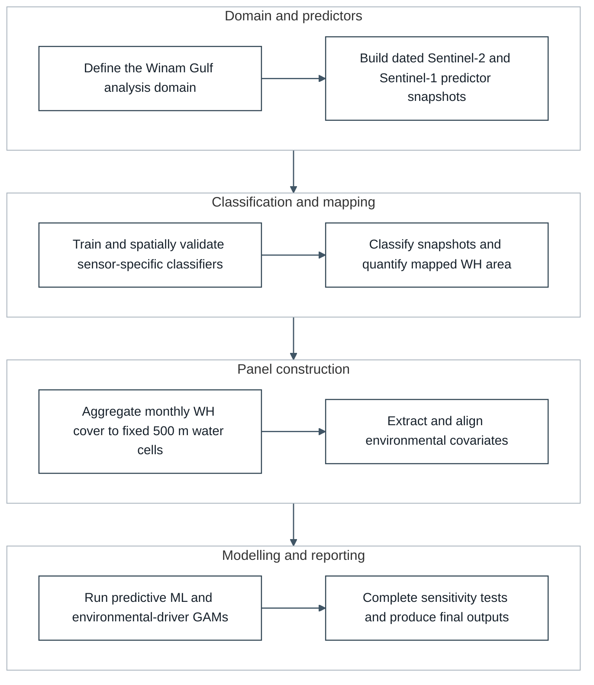
```mermaid
flowchart TB
    subgraph STAGE1["Domain and predictors"]
        direction LR
        A["Define the Winam Gulf analysis domain"]
        B["Build dated Sentinel-2 and Sentinel-1 predictor snapshots"]
        A --> B
    end

    subgraph STAGE2["Classification and mapping"]
        direction LR
        C["Train and spatially validate sensor-specific classifiers"]
        D["Classify snapshots and quantify mapped WH area"]
        C --> D
    end

    subgraph STAGE3["Panel construction"]
        direction LR
        E["Aggregate monthly WH cover to fixed 500 m water cells"]
        F["Extract and align environmental covariates"]
        E --> F
    end

    subgraph STAGE4["Modelling and reporting"]
        direction LR
        G["Run predictive ML and environmental-driver GAMs"]
        H["Complete sensitivity tests and produce final outputs"]
        G --> H
    end

    STAGE1 --> STAGE2
    STAGE2 --> STAGE3
    STAGE3 --> STAGE4

    classDef default fill:transparent,stroke:#324654,color:#17212B,stroke-width:1.25px,font-family:Arial,font-size:15px;
    style STAGE1 fill:transparent,stroke:#AAB4BE,stroke-width:1px
    style STAGE2 fill:transparent,stroke:#AAB4BE,stroke-width:1px
    style STAGE3 fill:transparent,stroke:#AAB4BE,stroke-width:1px
    style STAGE4 fill:transparent,stroke:#AAB4BE,stroke-width:1px
    linkStyle default stroke:#405565,stroke-width:1.4px;
```

## 2. Analytical extent and water mask

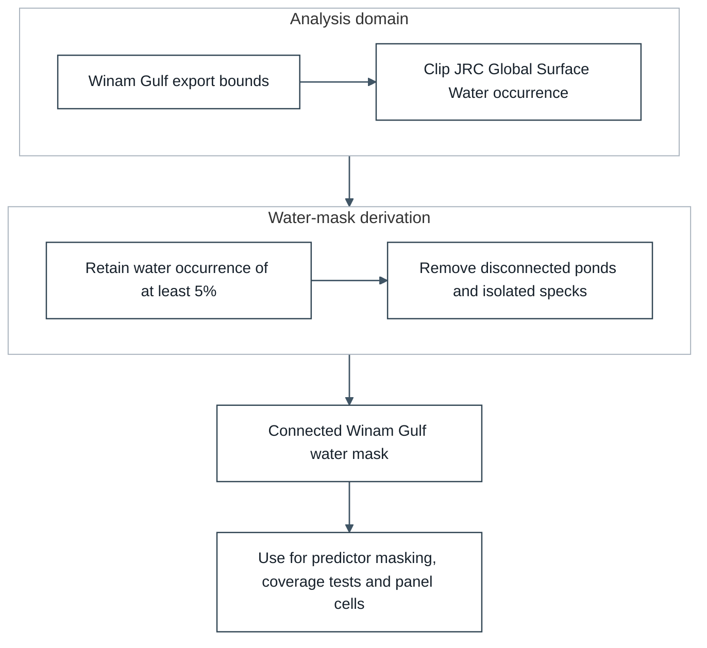
```mermaid
flowchart TB
    subgraph DOMAIN["Analysis domain"]
        direction LR
        AOI["Winam Gulf export bounds"]
        JRC["Clip JRC Global Surface Water occurrence"]
        AOI --> JRC
    end

    subgraph DERIVE["Water-mask derivation"]
        direction LR
        THRESH["Retain water occurrence of at least 5%"]
        CLEAN["Remove disconnected ponds and isolated specks"]
        THRESH --> CLEAN
    end

    DOMAIN --> DERIVE
    DERIVE --> MASK["Connected Winam Gulf water mask"]
    MASK --> APPLY["Use for predictor masking, coverage tests and panel cells"]

    classDef default fill:transparent,stroke:#324654,color:#17212B,stroke-width:1.25px,font-family:Arial,font-size:15px;
    style DOMAIN fill:transparent,stroke:#AAB4BE,stroke-width:1px
    style DERIVE fill:transparent,stroke:#AAB4BE,stroke-width:1px
    linkStyle default stroke:#405565,stroke-width:1.4px;
```

## 3. Satellite archives, temporal coverage and common spatial grid

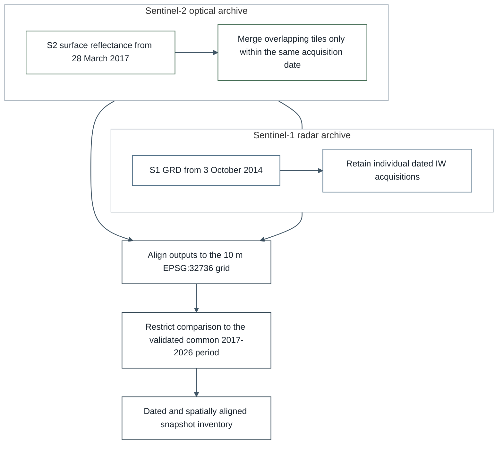
```mermaid
flowchart TB
    subgraph S2ROW["Sentinel-2 optical archive"]
        direction LR
        S2["S2 surface reflectance from 28 March 2017"]
        S2DATE["Merge overlapping tiles only within the same acquisition date"]
        S2 --> S2DATE
    end

    subgraph S1ROW["Sentinel-1 radar archive"]
        direction LR
        S1["S1 GRD from 3 October 2014"]
        S1DATE["Retain individual dated IW acquisitions"]
        S1 --> S1DATE
    end

    S2ROW ~~~ S1ROW
    S2ROW --> GRID["Align outputs to the 10 m EPSG:32736 grid"]
    S1ROW --> GRID
    GRID --> PERIOD["Restrict comparison to the validated common 2017-2026 period"]
    PERIOD --> INVENTORY["Dated and spatially aligned snapshot inventory"]

    classDef default fill:transparent,stroke:#324654,color:#17212B,stroke-width:1.25px,font-family:Arial,font-size:15px;
    classDef optical fill:transparent,stroke:#426B52,color:#17212B,stroke-width:1.25px,font-family:Arial,font-size:15px;
    classDef radar fill:transparent,stroke:#46677F,color:#17212B,stroke-width:1.25px,font-family:Arial,font-size:15px;
    class S2,S2DATE optical;
    class S1,S1DATE radar;
    style S2ROW fill:transparent,stroke:#AAB4BE,stroke-width:1px
    style S1ROW fill:transparent,stroke:#AAB4BE,stroke-width:1px
    linkStyle default stroke:#405565,stroke-width:1.4px;
```

## 4. Sentinel-2 preprocessing and predictor construction

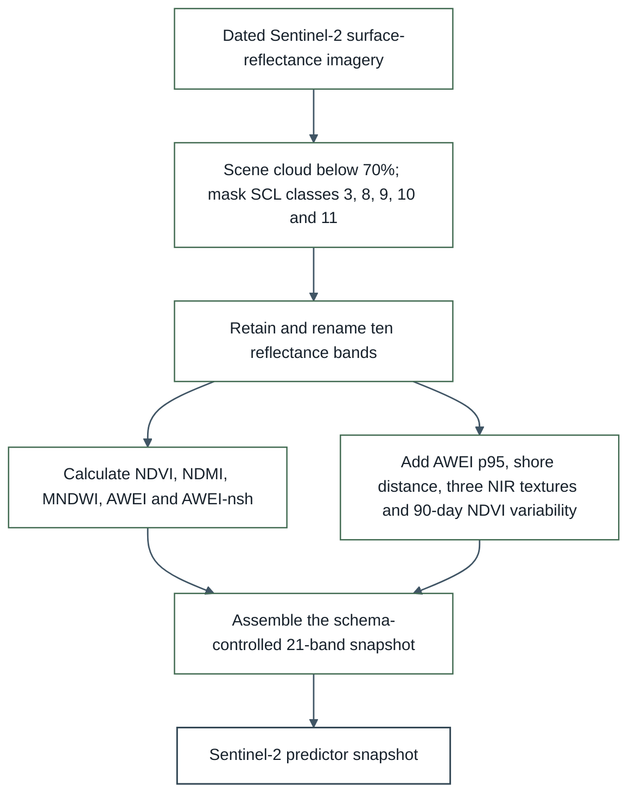
```mermaid
flowchart TB
    S2["Dated Sentinel-2 surface-reflectance imagery"] --> MASK["Scene cloud below 70%; mask SCL classes 3, 8, 9, 10 and 11"]
    MASK --> BANDS["Retain and rename ten reflectance bands"]

    BANDS --> INDICES["Calculate NDVI, NDMI, MNDWI, AWEI and AWEI-nsh"]
    BANDS --> CONTEXT["Add AWEI p95, shore distance, three NIR textures and 90-day NDVI variability"]

    INDICES --> STACK["Assemble the schema-controlled 21-band snapshot"]
    CONTEXT --> STACK
    STACK --> S2OUT["Sentinel-2 predictor snapshot"]

    classDef default fill:transparent,stroke:#426B52,color:#17212B,stroke-width:1.25px,font-family:Arial,font-size:15px;
    classDef output fill:transparent,stroke:#324654,color:#17212B,stroke-width:1.5px,font-family:Arial,font-size:15px;
    class S2OUT output;
    linkStyle default stroke:#405565,stroke-width:1.4px;
```

## 5. Sentinel-1 preprocessing and predictor construction

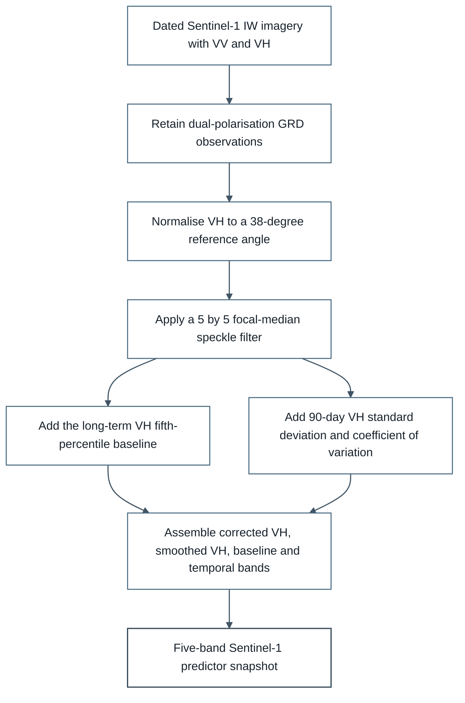
```mermaid
flowchart TB
    S1["Dated Sentinel-1 IW imagery with VV and VH"] --> FILTER["Retain dual-polarisation GRD observations"]
    FILTER --> CORRECT["Normalise VH to a 38-degree reference angle"]
    CORRECT --> SMOOTH["Apply a 5 by 5 focal-median speckle filter"]

    SMOOTH --> BASE["Add the long-term VH fifth-percentile baseline"]
    SMOOTH --> TEMP["Add 90-day VH standard deviation and coefficient of variation"]

    BASE --> STACK["Assemble corrected VH, smoothed VH, baseline and temporal bands"]
    TEMP --> STACK
    STACK --> S1OUT["Five-band Sentinel-1 predictor snapshot"]

    classDef default fill:transparent,stroke:#46677F,color:#17212B,stroke-width:1.25px,font-family:Arial,font-size:15px;
    classDef output fill:transparent,stroke:#324654,color:#17212B,stroke-width:1.5px,font-family:Arial,font-size:15px;
    class S1OUT output;
    linkStyle default stroke:#405565,stroke-width:1.4px;
```

## 6. Snapshot validity screening, export and provenance

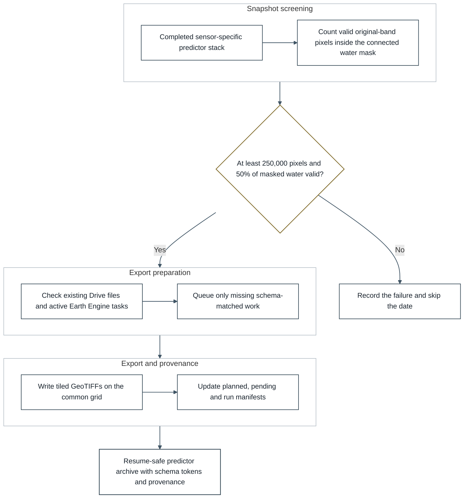
```mermaid
flowchart TB
    subgraph SCREEN["Snapshot screening"]
        direction LR
        SNAP["Completed sensor-specific predictor stack"]
        COVER["Count valid original-band pixels inside the connected water mask"]
        SNAP --> COVER
    end

    SCREEN --> GATE{"At least 250,000 pixels and 50% of masked water valid?"}
    GATE -->|No| SKIP["Record the failure and skip the date"]

    subgraph QUEUE["Export preparation"]
        direction LR
        CHECK["Check existing Drive files and active Earth Engine tasks"]
        TASK["Queue only missing schema-matched work"]
        CHECK --> TASK
    end

    subgraph RECORD["Export and provenance"]
        direction LR
        EXPORT["Write tiled GeoTIFFs on the common grid"]
        MANIFEST["Update planned, pending and run manifests"]
        EXPORT --> MANIFEST
    end

    GATE -->|Yes| QUEUE
    QUEUE --> RECORD
    RECORD --> ARCHIVE["Resume-safe predictor archive with schema tokens and provenance"]

    classDef default fill:transparent,stroke:#324654,color:#17212B,stroke-width:1.25px,font-family:Arial,font-size:15px;
    classDef decision fill:transparent,stroke:#806B2A,color:#17212B,stroke-width:1.5px,font-family:Arial,font-size:15px;
    classDef output fill:transparent,stroke:#324654,color:#17212B,stroke-width:1.5px,font-family:Arial,font-size:15px;
    class GATE decision;
    class ARCHIVE output;
    style SCREEN fill:transparent,stroke:#AAB4BE,stroke-width:1px
    style QUEUE fill:transparent,stroke:#AAB4BE,stroke-width:1px
    style RECORD fill:transparent,stroke:#AAB4BE,stroke-width:1px
    linkStyle default stroke:#405565,stroke-width:1.4px;
```

## 7. Reference labels and iterative correction

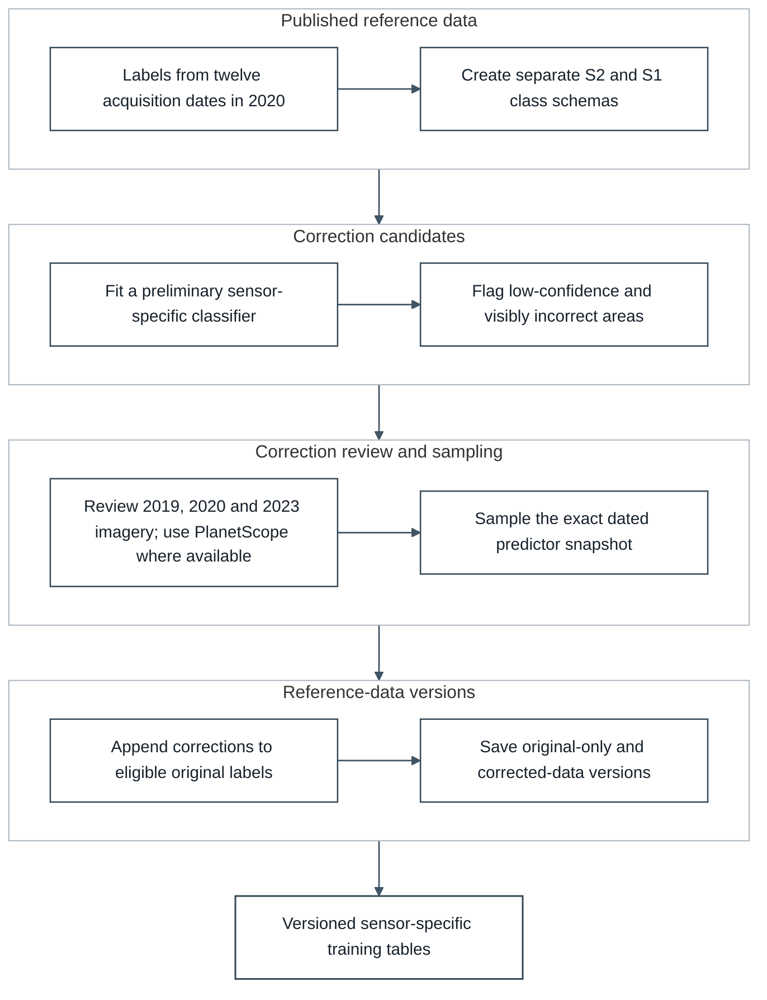
```mermaid
flowchart TB
    subgraph LABELROW["Published reference data"]
        direction LR
        LABELS["Labels from twelve acquisition dates in 2020"]
        SCHEMA["Create separate S2 and S1 class schemas"]
        LABELS --> SCHEMA
    end

    subgraph REVIEWROW["Correction candidates"]
        direction LR
        BASE["Fit a preliminary sensor-specific classifier"]
        FLAG["Flag low-confidence and visibly incorrect areas"]
        BASE --> FLAG
    end

    subgraph CORRECTROW["Correction review and sampling"]
        direction LR
        REVIEW["Review 2019, 2020 and 2023 imagery; use PlanetScope where available"]
        SAMPLE["Sample the exact dated predictor snapshot"]
        REVIEW --> SAMPLE
    end

    subgraph VERSIONROW["Reference-data versions"]
        direction LR
        APPEND["Append corrections to eligible original labels"]
        VERSION["Save original-only and corrected-data versions"]
        APPEND --> VERSION
    end

    LABELROW --> REVIEWROW
    REVIEWROW --> CORRECTROW
    CORRECTROW --> VERSIONROW
    VERSIONROW --> REF["Versioned sensor-specific training tables"]

    classDef default fill:transparent,stroke:#324654,color:#17212B,stroke-width:1.25px,font-family:Arial,font-size:15px;
    classDef output fill:transparent,stroke:#324654,color:#17212B,stroke-width:1.5px,font-family:Arial,font-size:15px;
    class REF output;
    style LABELROW fill:transparent,stroke:#AAB4BE,stroke-width:1px
    style REVIEWROW fill:transparent,stroke:#AAB4BE,stroke-width:1px
    style CORRECTROW fill:transparent,stroke:#AAB4BE,stroke-width:1px
    style VERSIONROW fill:transparent,stroke:#AAB4BE,stroke-width:1px
    linkStyle default stroke:#405565,stroke-width:1.4px;
```

## 8. Classifier comparison and spatial validation

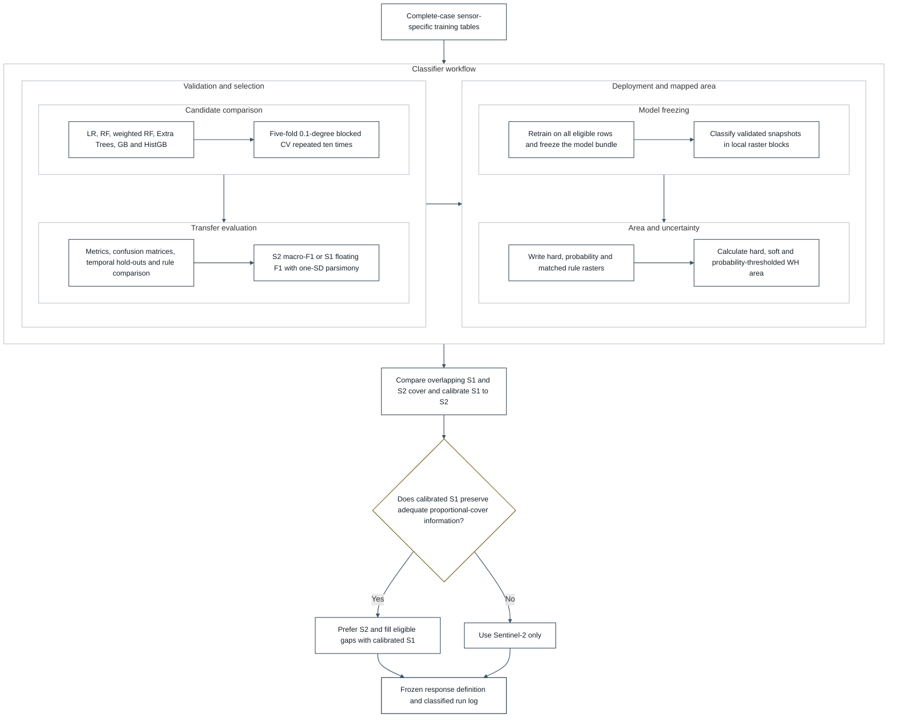
```mermaid
flowchart TB
    TRAIN["Complete-case sensor-specific training tables"] --> WORKFLOW

    subgraph WORKFLOW["Classifier workflow"]
        direction LR

        subgraph SELECTION["Validation and selection"]
            direction TB

            subgraph COMPARE1["Candidate comparison"]
                direction LR
                MODELS["LR, RF, weighted RF, Extra Trees, GB and HistGB"]
                CV["Five-fold 0.1-degree blocked CV repeated ten times"]
                MODELS --> CV
            end

            subgraph COMPARE2["Transfer evaluation"]
                direction LR
                DIAG["Metrics, confusion matrices, temporal hold-outs and rule comparison"]
                SELECT["S2 macro-F1 or S1 floating F1 with one-SD parsimony"]
                DIAG --> SELECT
            end

            COMPARE1 --> COMPARE2
        end

        subgraph PRODUCTION["Deployment and mapped area"]
            direction TB

            subgraph DEPLOY["Model freezing"]
                direction LR
                FREEZE["Retrain on all eligible rows and freeze the model bundle"]
                CLASSIFY["Classify validated snapshots in local raster blocks"]
                FREEZE --> CLASSIFY
            end

            subgraph OUTPUTS["Area and uncertainty"]
                direction LR
                MAPS["Write hard, probability and matched rule rasters"]
                AREA["Calculate hard, soft and probability-thresholded WH area"]
                MAPS --> AREA
            end

            DEPLOY --> OUTPUTS
        end

        SELECTION --> PRODUCTION
    end

    WORKFLOW --> CAL["Compare overlapping S1 and S2 cover and calibrate S1 to S2"]
    CAL --> DECIDE{"Does calibrated S1 preserve adequate proportional-cover information?"}
    DECIDE -->|Yes| GAP["Prefer S2 and fill eligible gaps with calibrated S1"]
    DECIDE -->|No| S2ONLY["Use Sentinel-2 only"]
    GAP --> RESPONSE["Frozen response definition and classified run log"]
    S2ONLY --> RESPONSE

    classDef default fill:transparent,stroke:#324654,color:#17212B,stroke-width:1.25px,font-family:Arial,font-size:15px;
    classDef decision fill:transparent,stroke:#806B2A,color:#17212B,stroke-width:1.5px,font-family:Arial,font-size:15px;
    classDef output fill:transparent,stroke:#324654,color:#17212B,stroke-width:1.5px,font-family:Arial,font-size:15px;
    class DECIDE decision;
    class RESPONSE output;
    style WORKFLOW fill:transparent,stroke:#AAB4BE,stroke-width:1px
    style SELECTION fill:transparent,stroke:#AAB4BE,stroke-width:1px
    style COMPARE1 fill:transparent,stroke:#AAB4BE,stroke-width:1px
    style COMPARE2 fill:transparent,stroke:#AAB4BE,stroke-width:1px
    style PRODUCTION fill:transparent,stroke:#AAB4BE,stroke-width:1px
    style DEPLOY fill:transparent,stroke:#AAB4BE,stroke-width:1px
    style OUTPUTS fill:transparent,stroke:#AAB4BE,stroke-width:1px
    linkStyle default stroke:#405565,stroke-width:1.4px;
```

## 9. Monthly spatial-panel construction

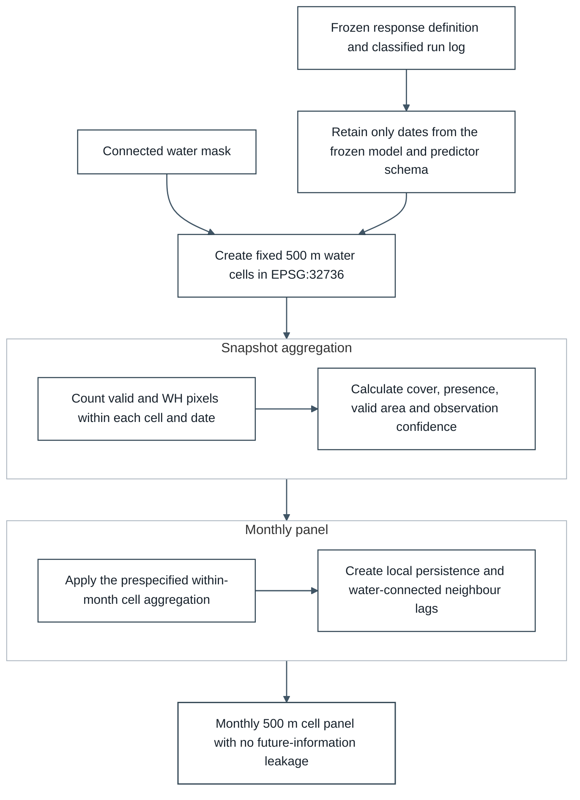
```mermaid
flowchart TB
    RESPONSE["Frozen response definition and classified run log"] --> SELECT["Retain only dates from the frozen model and predictor schema"]
    MASK["Connected water mask"] --> GRID["Create fixed 500 m water cells in EPSG:32736"]
    SELECT --> GRID

    subgraph AGG1["Snapshot aggregation"]
        direction LR
        COUNT["Count valid and WH pixels within each cell and date"]
        COVER["Calculate cover, presence, valid area and observation confidence"]
        COUNT --> COVER
    end

    subgraph AGG2["Monthly panel"]
        direction LR
        MONTH["Apply the prespecified within-month cell aggregation"]
        LAGS["Create local persistence and water-connected neighbour lags"]
        MONTH --> LAGS
    end

    GRID --> AGG1
    AGG1 --> AGG2
    AGG2 --> PANEL["Monthly 500 m cell panel with no future-information leakage"]

    classDef default fill:transparent,stroke:#324654,color:#17212B,stroke-width:1.25px,font-family:Arial,font-size:15px;
    classDef output fill:transparent,stroke:#324654,color:#17212B,stroke-width:1.5px,font-family:Arial,font-size:15px;
    class PANEL output;
    style AGG1 fill:transparent,stroke:#AAB4BE,stroke-width:1px
    style AGG2 fill:transparent,stroke:#AAB4BE,stroke-width:1px
    linkStyle default stroke:#405565,stroke-width:1.4px;
```

## 10. Environmental covariates

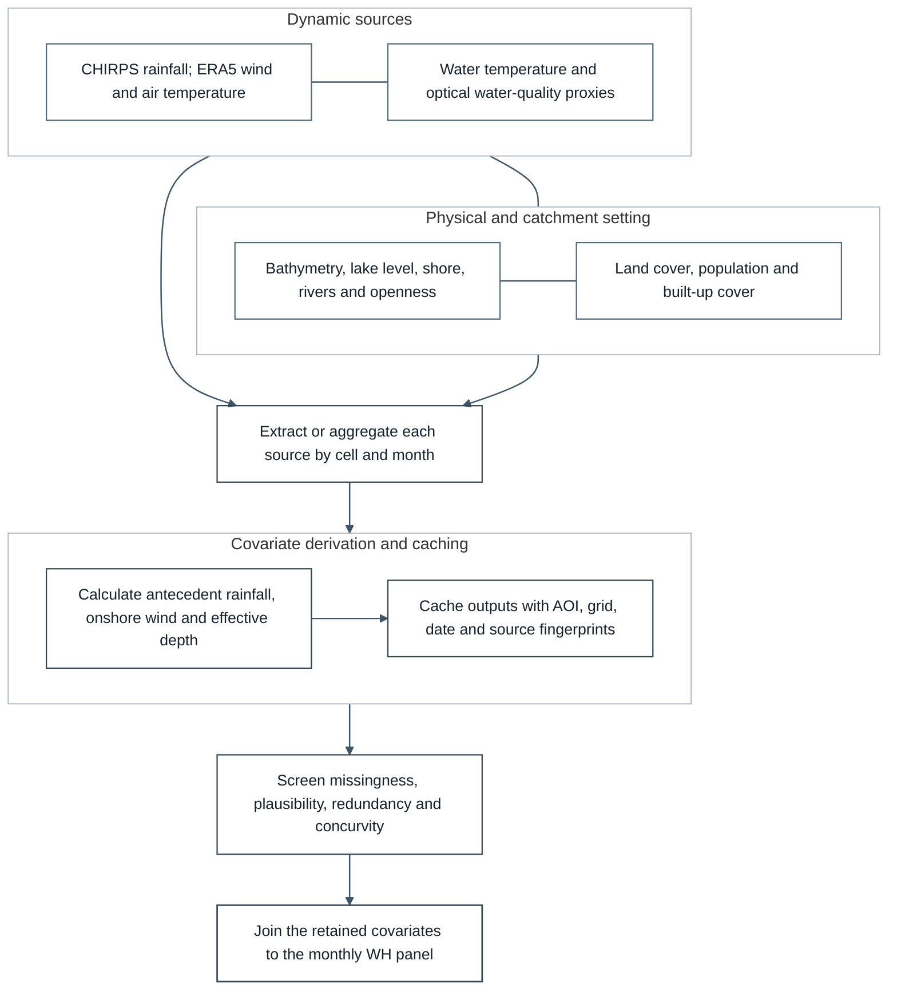
```mermaid
flowchart TB
    subgraph SOURCES1["Dynamic sources"]
        direction LR
        HYDRO["CHIRPS rainfall; ERA5 wind and air temperature"]
        WATER["Water temperature and optical water-quality proxies"]
        HYDRO ~~~ WATER
    end

    subgraph SOURCES2["Physical and catchment setting"]
        direction LR
        SETTING["Bathymetry, lake level, shore, rivers and openness"]
        PRESSURE["Land cover, population and built-up cover"]
        SETTING ~~~ PRESSURE
    end

    SOURCES1 ~~~ SOURCES2
    SOURCES1 --> EXTRACT["Extract or aggregate each source by cell and month"]
    SOURCES2 --> EXTRACT

    subgraph PROCESS["Covariate derivation and caching"]
        direction LR
        DERIVE["Calculate antecedent rainfall, onshore wind and effective depth"]
        CACHE["Cache outputs with AOI, grid, date and source fingerprints"]
        DERIVE --> CACHE
    end

    EXTRACT --> PROCESS
    PROCESS --> SCREEN["Screen missingness, plausibility, redundancy and concurvity"]
    SCREEN --> JOIN["Join the retained covariates to the monthly WH panel"]

    classDef default fill:transparent,stroke:#324654,color:#17212B,stroke-width:1.25px,font-family:Arial,font-size:15px;
    classDef source fill:transparent,stroke:#506B7C,color:#17212B,stroke-width:1.25px,font-family:Arial,font-size:15px;
    classDef output fill:transparent,stroke:#324654,color:#17212B,stroke-width:1.5px,font-family:Arial,font-size:15px;
    class HYDRO,WATER,SETTING,PRESSURE source;
    class JOIN output;
    style SOURCES1 fill:transparent,stroke:#AAB4BE,stroke-width:1px
    style SOURCES2 fill:transparent,stroke:#AAB4BE,stroke-width:1px
    style PROCESS fill:transparent,stroke:#AAB4BE,stroke-width:1px
    linkStyle default stroke:#405565,stroke-width:1.4px;
```

## 11. Predictive spatial-panel modelling

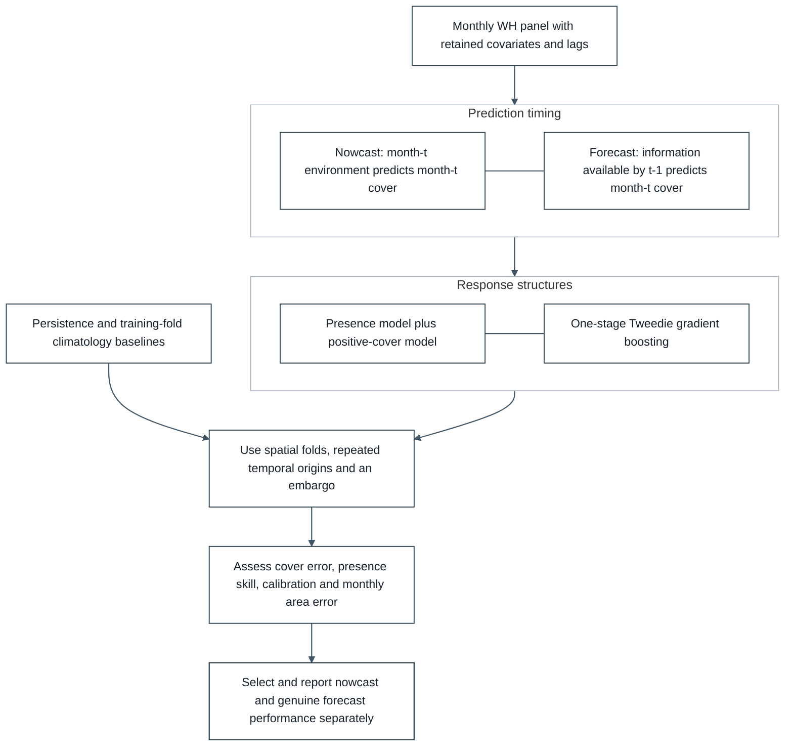
```mermaid
flowchart TB
    PANEL["Monthly WH panel with retained covariates and lags"] --> TIMING

    subgraph TIMING["Prediction timing"]
        direction LR
        NOW["Nowcast: month-t environment predicts month-t cover"]
        FUTURE["Forecast: information available by t-1 predicts month-t cover"]
        NOW ~~~ FUTURE
    end

    subgraph MODELS["Response structures"]
        direction LR
        HURDLE["Presence model plus positive-cover model"]
        TWEEDIE["One-stage Tweedie gradient boosting"]
        HURDLE ~~~ TWEEDIE
    end

    TIMING --> MODELS
    MODELS --> VALIDATE["Use spatial folds, repeated temporal origins and an embargo"]
    BASE["Persistence and training-fold climatology baselines"] --> VALIDATE
    VALIDATE --> METRICS["Assess cover error, presence skill, calibration and monthly area error"]
    METRICS --> RESULT["Select and report nowcast and genuine forecast performance separately"]

    classDef default fill:transparent,stroke:#324654,color:#17212B,stroke-width:1.25px,font-family:Arial,font-size:15px;
    classDef output fill:transparent,stroke:#324654,color:#17212B,stroke-width:1.5px,font-family:Arial,font-size:15px;
    class RESULT output;
    style TIMING fill:transparent,stroke:#AAB4BE,stroke-width:1px
    style MODELS fill:transparent,stroke:#AAB4BE,stroke-width:1px
    linkStyle default stroke:#405565,stroke-width:1.4px;
```

## 12. Environmental-driver modelling with GAMs

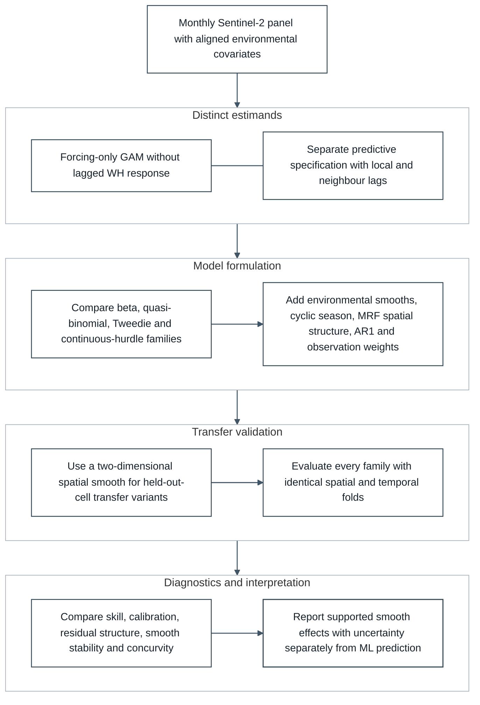
```mermaid
flowchart TB
    PANEL["Monthly Sentinel-2 panel with aligned environmental covariates"] --> ESTIMANDS

    subgraph ESTIMANDS["Distinct estimands"]
        direction LR
        FORCE["Forcing-only GAM without lagged WH response"]
        PREDICT["Separate predictive specification with local and neighbour lags"]
        FORCE ~~~ PREDICT
    end

    subgraph FORM["Model formulation"]
        direction LR
        FAMILY["Compare beta, quasi-binomial, Tweedie and continuous-hurdle families"]
        STRUCTURE["Add environmental smooths, cyclic season, MRF spatial structure, AR1 and observation weights"]
        FAMILY --> STRUCTURE
    end

    subgraph TRANSFERROW["Transfer validation"]
        direction LR
        TRANSFER["Use a two-dimensional spatial smooth for held-out-cell transfer variants"]
        VALIDATE["Evaluate every family with identical spatial and temporal folds"]
        TRANSFER --> VALIDATE
    end

    subgraph REPORTROW["Diagnostics and interpretation"]
        direction LR
        DIAG["Compare skill, calibration, residual structure, smooth stability and concurvity"]
        EFFECTS["Report supported smooth effects with uncertainty separately from ML prediction"]
        DIAG --> EFFECTS
    end

    ESTIMANDS --> FORM
    FORM --> TRANSFERROW
    TRANSFERROW --> REPORTROW

    classDef default fill:transparent,stroke:#324654,color:#17212B,stroke-width:1.25px,font-family:Arial,font-size:15px;
    classDef output fill:transparent,stroke:#324654,color:#17212B,stroke-width:1.5px,font-family:Arial,font-size:15px;
    class EFFECTS output;
    style ESTIMANDS fill:transparent,stroke:#AAB4BE,stroke-width:1px
    style FORM fill:transparent,stroke:#AAB4BE,stroke-width:1px
    style TRANSFERROW fill:transparent,stroke:#AAB4BE,stroke-width:1px
    style REPORTROW fill:transparent,stroke:#AAB4BE,stroke-width:1px
    linkStyle default stroke:#405565,stroke-width:1.4px;
```

## 13. Sensitivity analysis and reproducibility

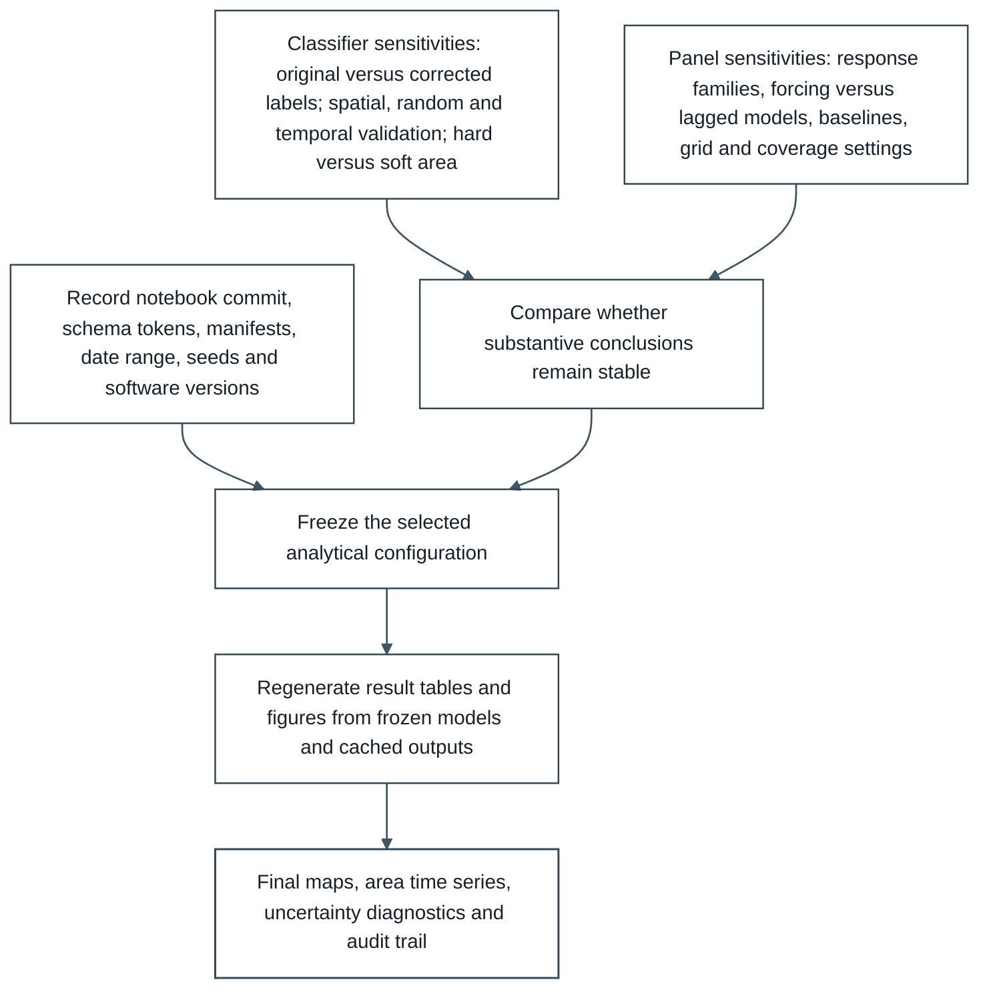
```mermaid
flowchart TB
    CLASS["Classifier sensitivities: original versus corrected labels; spatial, random and temporal validation; hard versus soft area"] --> COMPARE
    PANEL["Panel sensitivities: response families, forcing versus lagged models, baselines, grid and coverage settings"] --> COMPARE
    COMPARE["Compare whether substantive conclusions remain stable"]

    PROV["Record notebook commit, schema tokens, manifests, date range, seeds and software versions"] --> FREEZE["Freeze the selected analytical configuration"]
    COMPARE --> FREEZE
    FREEZE --> REBUILD["Regenerate result tables and figures from frozen models and cached outputs"]
    REBUILD --> FINAL["Final maps, area time series, uncertainty diagnostics and audit trail"]

    classDef default fill:transparent,stroke:#324654,color:#17212B,stroke-width:1.25px,font-family:Arial,font-size:15px;
    classDef output fill:transparent,stroke:#324654,color:#17212B,stroke-width:1.5px,font-family:Arial,font-size:15px;
    class FINAL output;
    linkStyle default stroke:#405565,stroke-width:1.4px;
```

## Execution order represented

1. Define the domain and water mask.
2. Acquire and align the satellite archives.
3. Construct Sentinel-2 and Sentinel-1 predictor stacks.
4. Screen, export and record valid snapshots.
5. Prepare and refine sensor-specific reference labels.
6. Compare, validate and select classifiers before full-archive deployment.
7. Produce classified rasters, mapped-area estimates and the final response definition.
8. Build the monthly 500 m spatial panel.
9. Extract and align environmental covariates.
10. Run predictive modelling and environmental-driver GAMs.
11. Complete sensitivity analysis, freeze provenance and regenerate final outputs.
